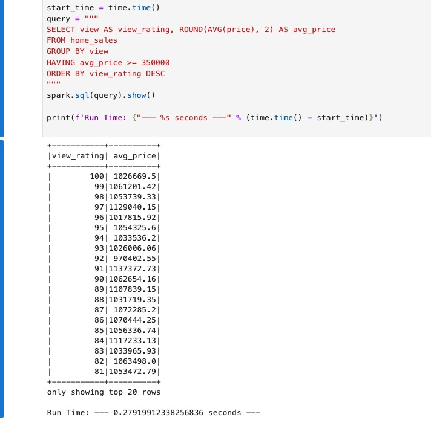
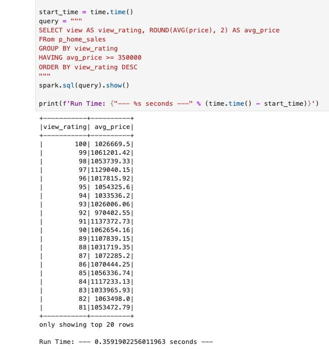

# README: Spark Query Performance Analysis

## Overview
This repository documents the analysis of query execution time in Apache Spark, including the impact of caching and partitioning on performance. The project was executed using Google Colab and Jupyter Notebook with Apache Spark. 


## Tools Used
- **Jupyter Notebook and Google Colab**: Used for executing Spark queries locally.
- **Apache Spark**: Used for big data processing and query execution.
- **Parquet Format**: Used for efficient data storage and retrieval.

## Query Execution Time Analysis
This project analyzes the impact of different Spark optimizations on query execution time:

1. **Without Caching and Partitioning**: The initial query took **0.384 seconds**.
2. **After Caching**: Execution time drastically reduced to **0.27 seconds** since Spark stored the data in memory.
  
3. **After Partitioning by `date_built` and Using a Temporary View**: Execution time was **0.359 seconds**, showing that partitioning is beneficial only when queries utilize partition pruning.
   

## Conclusion
- **Caching** significantly reduces query time by avoiding disk I/O.
- **Partitioning** improves performance only when queries filter on partition columns.
- **Parquet format** enhances query efficiency by enabling columnar storage and predicate pushdown.
- **Jupyter Notebook and Google Colab:** this project also identify query time differ based on platform. In my case jupyter notebook query running time was lower. 

## Running Spark on Jupyter Notebook
To set up and run Spark on Jupyter Notebook, follow these steps:
1. **Install Java, Spark, and Hadoop**
```sh
sudo apt update
sudo apt install openjdk-8-jdk -y
wget https://archive.apache.org/dist/spark/spark-3.0.1/spark-3.0.1-bin-hadoop2.7.tgz
mkdir spark
tar -xvzf spark-3.0.1-bin-hadoop2.7.tgz -C spark/
```

2. **Set Environment Variables**
```sh
export SPARK_HOME=~/spark/spark-3.0.1-bin-hadoop2.7
export PATH=$SPARK_HOME/bin:$PATH
export PYSPARK_PYTHON=python3
```

3. **Install Findspark and PySpark**
```sh
pip install findspark pyspark
```

4. **Configure Jupyter Notebook to Recognize Spark**
```python
import findspark
findspark.init()
import pyspark
from pyspark.sql import SparkSession

spark = SparkSession.builder.appName("SparkQueryPerformance").getOrCreate()
```

5. **Verify Spark Installation**
```python
spark
```
## Author
Atnaf

